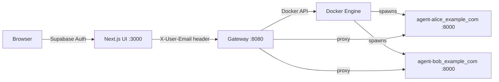

# Local Stack Integration Plan

## Architecture



- **Next.js frontend**: Already built. Authenticates via Supabase, resolves user email, proxies to gateway with `X-User-Email` header.
- **Gateway**: Rewritten Node.js service. Routes requests to per-user agent containers, spawning them on-demand via the Docker API (`dockerode`).
- **Agent containers**: `nanobot-tutor` image, one per user, created dynamically by the gateway.

## Gateway Rewrite

Create a new gateway at `gateway/server.js` (project root level) with:

- **`dockerode`** to interact with the Docker socket
- **Container naming**: sanitize email (`alice@example.com` -> `agent-alice_example_com`)
- **On request**: look up running container by name. If not found, create one from the pre-built `nanobot-tutor` image with:
  - Volume: `./data/<sanitized_email>/` -> `/root/.nanobot`
  - Volume: shared `config.json` -> `/root/.nanobot/config.json`
  - Env: `NANOBOT_HTTP_PORT=8000`
  - Network: shared Docker network (`nanobot-net`)
- **Readiness wait**: after spawning, poll `GET /health` on the agent until it responds (with timeout)
- **Proxy**: forward the request path and body to `http://<container_name>:8000/<path>`
- **Endpoints to proxy**: `/chat`, `/files`, `/uploads`, `/memory`, `/health`, `/conversations` (pass-through from frontend)

## Frontend Adjustments

Update the three Next.js API routes to:

- Send `X-User-Email` header (the actual Supabase email) instead of a hardcoded agent ID
- Call gateway paths that match the agent's HTTP API: `/chat`, `/files`, `/uploads` (already correct)

Files to update:

- `frontend/ui/src/app/api/chat/route.ts` — change `X-User-ID: agentId` to `X-User-Email: email`, remove the hardcoded mapping logic
- `frontend/ui/src/app/api/files/route.ts` — same header change
- `frontend/ui/src/app/api/upload/route.ts` — same header change

## Docker Compose

New `docker-compose.yml` at the project root with:

- **web-ui**: builds from `frontend/ui/Dockerfile`, build-args for `NEXT_PUBLIC_*`, env vars for `GATEWAY_URL=http://gateway:8080`
- **gateway**: builds from `gateway/Dockerfile`, mounts `/var/run/docker.sock`, mounts `./data/` for agent volumes, connects to `nanobot-net`
- **nanobot-net**: a shared Docker network the gateway attaches spawned agents to

Agent containers are NOT in the compose file — they are created dynamically by the gateway.

## Data Layout

```
data/
  alice_example_com/       # per-user agent data
    workspace/
      memory/
      files_uploaded/
    sessions/
    config.json            # symlink or copy of shared config
  bob_example_com/
    ...
config.json                # shared LLM API keys (mounted into each agent)
```

## Key Considerations

- **Docker socket**: The gateway container needs `-v /var/run/docker.sock:/var/run/docker.sock`. This is standard for local dev but has security implications in production.
- **Pre-built image**: The `nanobot-tutor` image must be built before running the stack. The compose file can include a one-time build step or assume it exists.
- **First-request latency**: Spawning a new container takes a few seconds. The gateway should hold the request and respond once the agent is ready (not return an error).
- **No cleanup initially**: For the minimal local version, agent containers stay running. A TTL-based reaper can be added later.

## Todos

- [ ] Create `gateway/` with new `server.js` using dockerode for dynamic agent spawning, health polling, and request proxying
- [ ] Create Dockerfile for the new gateway at `gateway/Dockerfile`
- [ ] Update the 3 Next.js API routes to send `X-User-Email` instead of `X-User-ID` with hardcoded mapping
- [ ] Create `docker-compose.yml` with web-ui, gateway, shared network, and Docker socket mount
- [ ] Update `frontend/docker-run.sh` or create a new script to build nanobot-tutor image and run the full compose stack
