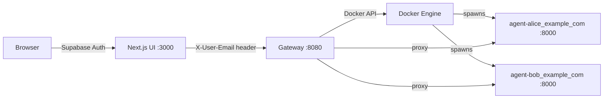

# Local Stack

## How to Run Locally

**Prerequisites:**
- Docker
- `frontend/ui/.env.local` with `NEXT_PUBLIC_SUPABASE_URL` and `NEXT_PUBLIC_SUPABASE_ANON_KEY`
- `~/.nanobot/config.json` with your LLM API keys

**Start the stack:**
```bash
./run.sh
```

**Options:**
| Command | Description |
|---------|-------------|
| `./run.sh` | Start web-ui + gateway, logs stream to terminal |
| `./run.sh -d` | Same, but detached (runs in background) |
| `./run.sh -l` | Enable context logging (LLM context → `data/<user>/logs/`) |
| `./run.sh -l -d` | Detached with context logging |

---

## What `run.sh` Does

1. **Loads env** from `frontend/ui/.env.local` (Supabase keys for the UI)
2. **Builds `nanobot-tutor` image** — the agent image used for per-user containers
3. **Creates `data/`** if missing
4. **Builds the gateway** via docker compose
5. **Starts the stack** — brings up `web-ui` and `gateway` (and any args you pass, e.g. `-d`)

---

## What Spins Up

| Service | Port | What it does |
|---------|------|--------------|
| **web-ui** | 3000 | Next.js frontend. Supabase auth, chat UI. Proxies `/chat`, `/files`, `/uploads`, `/memory`, `/conversations` to the gateway with `X-User-Email` header. |
| **gateway** | 8080 | Node.js service. Receives requests, spawns per-user agent containers on demand via Docker API, proxies requests to them. Uses `dockerode` + Docker socket. |
| **agent-&lt;user&gt;** | 8000 (internal) | One per user, created by the gateway. Runs `nanobot gateway` (HTTP channel). Each has its own `data/<sanitized_email>/` workspace. |

Agent containers are **not** in docker-compose — the gateway creates them when a user first hits the app.

---

## Architecture


```mermaid
flowchart LR
    Browser -->|Supabase Auth| NextJS["Next.js UI :3000"]
    NextJS -->|"X-User-Email header"| Gateway["Gateway :8080"]
    Gateway -->|"Docker API"| DockerEngine["Docker Engine"]
    DockerEngine -->|spawns| Agent1["agent-alice_example_com :8000"]
    DockerEngine -->|spawns| Agent2["agent-bob_example_com :8000"]
    Gateway -->|proxy| Agent1
    Gateway -->|proxy| Agent2
```

---

## Data Layout

```
data/
  <sanitized_email>/          # per-user agent data (e.g. admin_gmail_com)
    workspace/
      memory/
      files_uploaded/
    sessions/
    logs/                     # if -l: context.log, subagent_context_*.log
    config.json               # copied from shared config at spawn
```

Shared config: `~/.nanobot/config.json` (LLM keys) is mounted into the gateway and copied into each agent's data dir at first spawn.

---

## Key Details

- **Docker socket**: Gateway mounts `/var/run/docker.sock` to spawn containers. Fine for local dev; consider security in production.
- **First request**: Spawning a new agent takes a few seconds. The gateway waits for `/health` before proxying.
- **Workspace template**: `nanobot-tutor/workspace` is mounted read-only as `/template/workspace`; new users get a copy in their data dir.

---

## Completed Setup (Reference)

- [x] Gateway at `gateway/server.js` — dockerode, health polling, request proxying
- [x] `gateway/Dockerfile`
- [x] Next.js API routes use `X-User-Email` instead of hardcoded agent ID
- [x] `docker-compose.yml` — web-ui, gateway, nanobot-net
- [x] `run.sh` — builds nanobot-tutor, runs compose stack, optional `-l` for context logging
